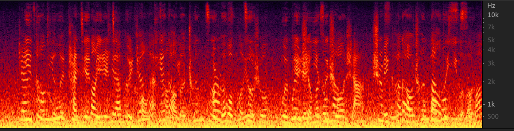
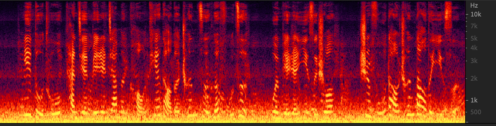

# beamforming
本项目为任意空间阵列流形，任意声源位置的beamforming仿真提供一个框架流程。  
内置**宽带MVDR，宽带CBF，宽带MUSIC算法**的实现, 并对音频进行了流式处理的逻辑实现。


## structure
**/Beamform**文件夹下包含了对阵列的建模，其中包含阵列**接收信号**，以及**俯仰角算法抑制**，**DOA以及Beamforming**，以及最终**信号重建**的具体实现流程。

## quick start
使用示例见audio_denoise_demo.ipynb，其中提供了如何设置若干声源，进行盲源分离以及beamforming的例子。
其中以下代码读取了三个声源，并被放置在三个不同的位置:
```python
audio_data0, _ = librosa.load('./example_audio/0119_audio1.wav', sr=32000)
audio_data1, _ = librosa.load("./example_audio/0119_noise1.wav", sr=32000)
audio_data2, _ = librosa.load("./example_audio/0119_noise2.wav", sr=32000)

# 设置声源位置
audio0_x = 2.0
audio0_y = 0.0
audio0_z = 0.0

audio1_x = 6.5
audio1_y = 5.5
audio1_z = 0.0

audio2_x = -2.0
audio2_y = 0.0
audio2_z = 0.0
```

阵列接受到的信号为**angle_filter_input.wav**。
 

最终经过俯仰角抑制及输出的信号为**angle_filter_output+bf.wav**
 

有关doa和beamform的例子见audio_beamform_demo.ipynb及audio_doa_demo.ipynb。

## Something about Deploy
- C++的推理比Python推理快两个数量级，本项目给出的仿真例子用到了61组mic，实际可以缩减也达到类似的效果。
- Beamforming之前需要经过doa扫描，可以通过合理设置扫描半径来加速算法运行。
- 实际上并不用对每个频点进行运算，可以选取核心频点运行算法。
- 该阵列建议使用低采样率，不然很可能满足不了实时推理的需求，demo给的例子为32k采样率，实际上建议16k采样率减少计算量。


